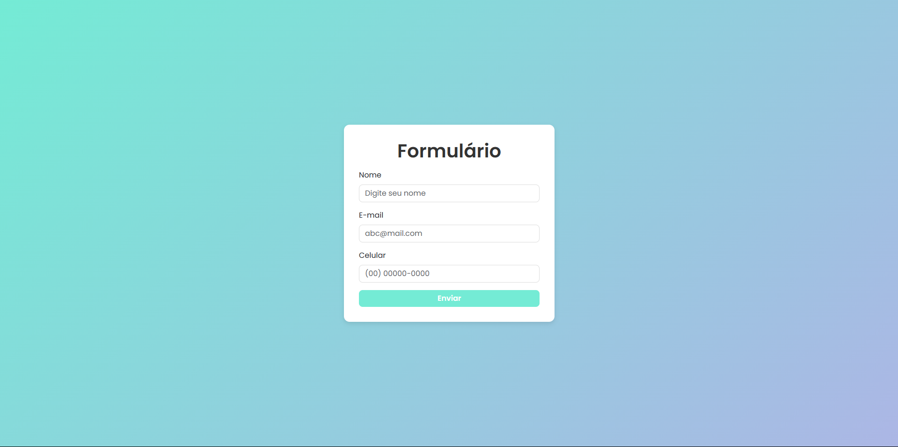

# Formulário com Bootstrap e Validação

[🇺🇸 English Version](https://github.com/gabrielcamarate/Formulario-Jquery-Bootstrap-Responsive/tree/main/README.md) | [🇧🇷 Versão em Português](https://github.com/gabrielcamarate/Formulario-Jquery-Bootstrap-Responsive/tree/main/PT-BR-README.md)

---

## Formulario - Validação  

  

Este é um projeto de formulário responsivo utilizando **Bootstrap**, **jQuery** e **CSS personalizado** com um design moderno e futurista. O formulário inclui validação de campos, um modal de sucesso e um esquema de cores inspirado em um estilo **cyberpunk**.

## Tecnologias Utilizadas
- **HTML5**
- **CSS3 (com variáveis para personalização de cores)**
- **Bootstrap 5**
- **jQuery e jQuery Mask** (para manipulação do DOM e formatação de entrada de dados)

## Funcionalidades
✅ Formulário responsivo e estilizado <br>
✅ Validação de campos (nome, e-mail e telefone) <br>
✅ Feedback visual para erros de preenchimento <br>
✅ Máscara de telefone no formato (XX) XXXXX-XXXX <br>
✅ Exibição de modal de sucesso após envio <br>
✅ Reset automático do formulário após envio bem-sucedido <br>

## Estrutura do Projeto
```
📂 formulario-bootstrap
├── 📄 index.html
├── 📄 style.css
├── 📄 README.md
```

## Como Usar
1. Clone ou baixe o repositório.
2. Abra o arquivo `index.html` em um navegador.
3. Preencha o formulário com dados válidos.
4. Clique em "Enviar" para ver a validação em ação.
5. Se tudo estiver correto, o modal de sucesso será exibido!

## Personalização de Cores
As cores do projeto estão definidas em variáveis CSS dentro do `style.css`:
```css
:root {
    --primary-color: #74ebd5;
    --primary-hover: #5ac8c8;
    --background-gradient: linear-gradient(135deg, #74ebd5, #acb6e5);
    --text-color: #333;
    --border-color: #ddd;
    --box-shadow-color: rgba(0, 0, 0, 0.1);
    --focus-shadow-color: rgba(116, 235, 213, 0.5);
    --modal-header-color: white;
}
```
Altere esses valores para personalizar a paleta de cores do projeto.

## Melhorias Futuras
- Adicionar um backend para armazenar os dados do formulário
- Implementar mais efeitos visuais e animações CSS
- Criar um modo escuro/dia dinâmico

---

### Autor
💻 Desenvolvido por **Gabriel Camarate**

📌 Se gostou do projeto, não esqueça de dar um ⭐ no repositório!

---

### Licença

Este projeto é de código aberto e está disponível sob a licença MIT.

